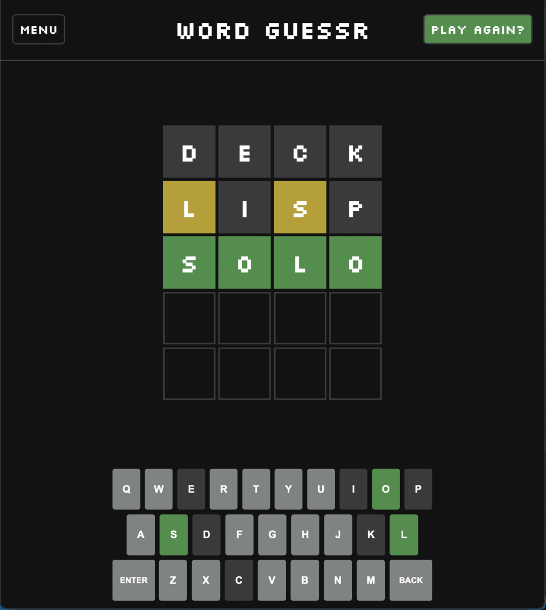
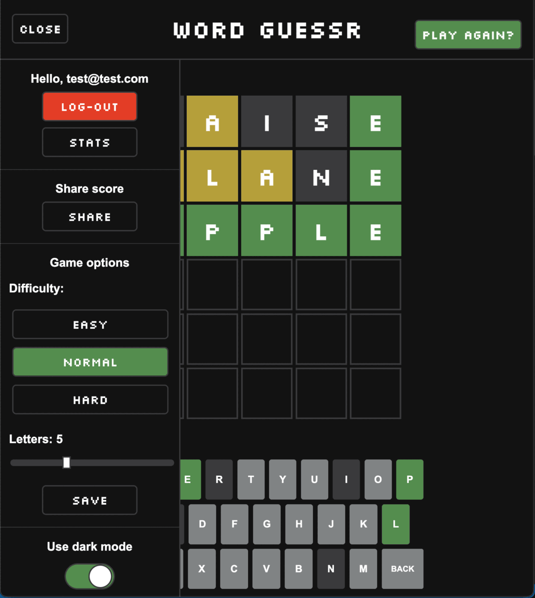

# Word Guessr (Wordle clone)

<p align="center">
  
</p>

It is web app developed with Javascript and Flask (Python) as back-end to test my fullstack abilities.

Based on a popular web app, the objective is to guess the word with a limited number of attempts. The user can change the parameters of # of letters and attempts.

## Tech Stack

- JavaScript
- Python
- Flask
- HTML
- CSS
- SQL database
- API calls

## Implemented Features

- Animations done manually in CSS
- Share score using emojis 🟩🥲🤩
- Dynamic board size based on settings (word length and # of attempts)



- Theming support for Dark & Light modes (Default theme is light mode)



- **Words API**
  - Get random words to play
  - Check if submitted word exists
  - Display definition at the end of game
- **User accounts**
  - Register & Log-in
  - Store them in a SQLite database
  - Encrypt passwords by salting them and using a hash (SHA-256)
  - Store statistics
- **Storage**
  - Retrieve stats from **LocalStorage** when not logged in
  - Retrieve stats from **SQLite3 DB** when logged in
  - Store theme preference
  - Store submitted words
- **Statistics**
  - Games played
  - Win percentage
  - Current win streak
  - Max streak


## Getting started

### Install dependencies

The following dependencies must be installed by entering the following commands in the terminal:

`pip install flask`

- Needed for Python web server
- activate venv environment

`pip install python-dotenv`

- Needed for environment variables

`pip install requests`

- Needed for API calls

`pip install flask-sqlalchemy`

- Needed for SQL database

### Signing up for Words API

Go to [rapidapi.com](www.rapidapi.com), sign up and select the Basic plan for [Words API](https://rapidapi.com/dpventures/api/wordsapi/). Be sure to copy the API key.

### Environment variables

We can use environment variables with `python-dotenv` and Flask to hide secrets such as API keys.
(See [this](https://flask.palletsprojects.com/en/2.2.x/cli/#environment-variables-from-dotenv) for help on how to use environment variables with flask)

Create `.env` file and add:

    RAPID_API_KEY = {KEY GOES HERE}

on `app.py` first we need to import the `os` package so that we can use the command `os.environ.get()` command to fetch the environment variable stored in `.env` file.

[Source](<https://medium.com/thedevproject/start-using-env-for-your-flask-project-and-stop-using-environment-variables-for-development-247dc12468be>)

Furthermore, Flask needs a secret key to store session variables.
We can create one ourselves by entering the following commands into the python interpreter.

``` python
>>> import os
>>> print(os.urandom(24).hex())
```

And copying the random string into tbe `.env` file:

    SECRET_KEY = {KEY GOES HERE}

### Creating the database

Type the following line in the .py file where the main Flask app is located.

``` python
app.config['SQLALCHEMY_DATABASE_URI'] = 'sqlite:///DB_NAME.sqlite3'
```

Notice the "///" (three forward slashes) as it is important to create the database file in the root directory of the project folder (relative path).

Following the [quickstart guide](https://flask-sqlalchemy.palletsprojects.com/en/2.x/quickstart/) from the docs:

``` python
from flask import Flask
from flask_sqlalchemy import SQLAlchemy

# Import app from app.py
from app import app
db = SQLAlchemy(app)

class User(db.Model):
  ...
```

Then we run in the python terminal the following command

``` python
>>> from app import db
>>> db.create_all()
```

### Running the server

- Execute `flask run`
- Go to <http://127.0.0.1:5000/>
- Voilà !

<p align="center">
  
</p>

## Project structure

The project has the following tree structure:

    .
    ├── README.md         (Readme file)
    ├── app.py            (Flask backend)
    ├── database.py       (Database configuration)
    ├── static
    │   ├── app.js        (Main javascript frontend code)
    │   ├── register.js   (Js file for register.html)
    │   ├── favicon.ico   (Website icon)
    │   └── style.css     (Styles sheet)
    ├── templates
    │   ├── register.html
    │   ├── layout.html   (Main HTML layout using Jinja templates)
    │   └── index.html    (Main website)

## Main takeaways

The main things I learned after developing this web app are:

- Javascript and Python
- HTML and CSS styling
- How Back-ends work using Flask
- Using LocalStorage with JS
- Sending data back and forth between the Front-end and Back-end
  - API and HTTP requests using RESTful commands
  - Use of JSON data formats
  - JS fetch requests (including async/await)

Thank you, this was CS50!
